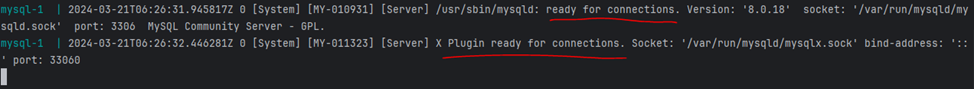
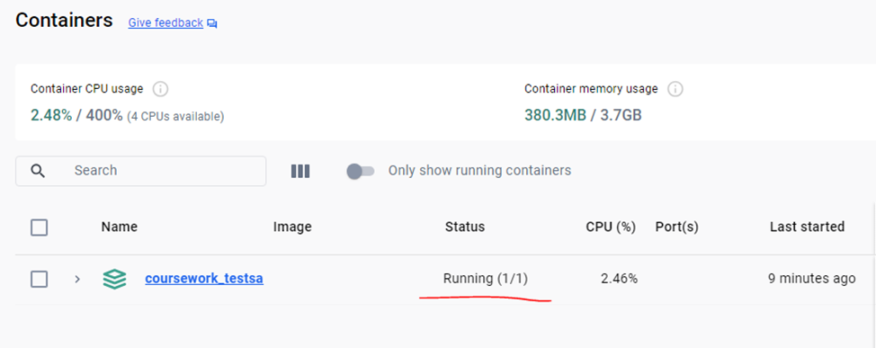
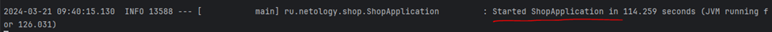
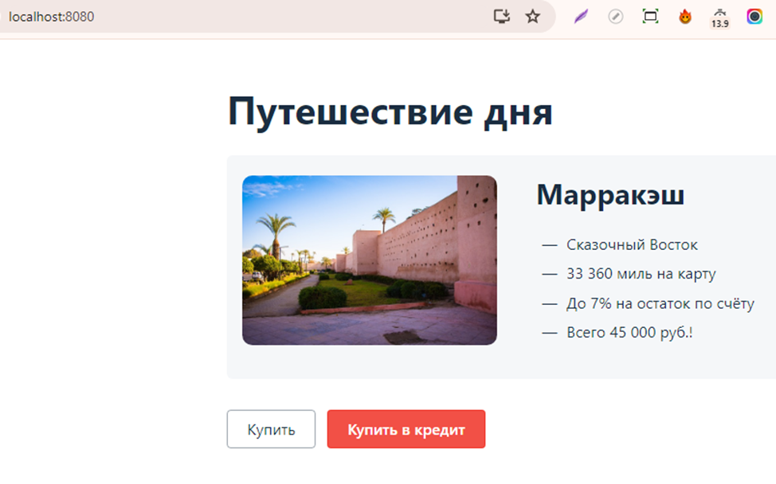

## Процедура запуска автотестов

1. Проверить подключенное _интернет-соединение_
2. **Клонировать** проект с GitHub в локальный репозиторий, открыть проект в IDE на локальной машине
3. Подключить **Docker**, установить плагин **Docker Compose** согласно инструкции:
   https://github.com/netology-code/aqa-homeworks/blob/master/docker/installation.md
4. После запуска **Docker Desktop** убедиться, что _режим движка_ **Engine running**
5. В терминале IDE, в директории _docker-compose.yml_ запустить контейнер с базой данных, команда:
_**docker compose up**_ и дождаться статуса **"ready for connections"**

 В _Docker Compose_ в разделе _Containers_ будет следующий статус:

6. В терминале IDE, в новой вкладке запустить приложение командой:

**java -jar ./aqa-shop.jar**

Убедиться, что статус приложения в терминале **"started ShopApplication"**

_Далее приложение можно запустить в браузере по адресу:_

**http://localhost:8080/**

7. В терминале IDE, в невой вкладке запустить автотесты командой:

**./gradlew clean test --info**

8. Для формирования отчета **Allure** в терминале вызвать команду:

**./gradlew allureReport**

