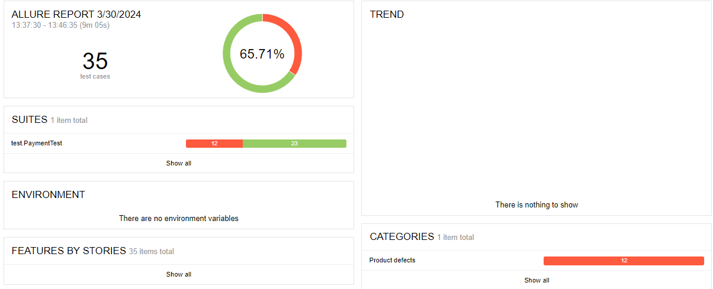

## Отчёт о проведённой автоматизации

1. Реализованы автотесты согласно плану автоматизации
2. В дополнение к перечисленному в Plan.md при реализации тестов использованы следующие инструменты:

- **'com.google.code.gson:gson:2.8.6'** - конвертатор в формат JSON для тестирования API
- **'mysql:mysql-connector-java:8.0.22'** - для подключения к СУБД MySQL 
- **'commons-dbutils:commons-dbutils:1.7'** - для лаконичных запросов к СУБД

3. Сработали риски:

- медленная работа и возможные сбои в работе локальной машины (по опыту работы с инструментами контейнеризации)

4. Общий итог по времени: 

- запланировано: **40 часов**
- потрачено (без учета issues): **23 часа**
- потрачено (с учетом issues): **25 часов**

Расхождение связано 
с недостаточным опытом оценки времени на реализацию подобных задач.

5. Отчет Allure

